# Deriving the LeSS Framework

The [LeSS website](https://less.works) has some great diagrams and text which cover the LeSS and LeSS Huge frameworks. Even more detail can be found in the three [LeSS books](https://less.works/resources/learning-resources/books) written by Craig Larman and Bas Vodde. For someone who is new to Scrum the level of detail can be a little overwhelming. The following series of diagrams and associated caption text attempt to explain the LeSS meta-process is nothing other than a very natural generalization of single team Scrum.

The diagrams will walk through the derivation one step at a time, explaining the reasoning behind each step. The end result will be what mature professional Scrum teams have done for years, which turns out to be exactly what LeSS has canonized as the LeSS framework.

Unlike many other approaches, LeSS places a great deal of focus on addressing the underlying organizational structure necessary to establish a supportive culture. LeSS also assumes and requires excellent engineering practices. Very little of those critical aspects are detailed here as this sequence of diagrams is focused on the events, roles, and artifacts of LeSS.

People who have spent any time in a classroom setting with me will recognize these diagrams are very close to what I scrawl on a whiteboard. Unlike most other digital versions you will find, these have been specifically designed to be whiteboard scrawl friendly.

# Deriving LeSS: Step 0: Multiple Independent Scrum Teams

We will start with three completely independent Scrum teams working on three completely independent products. 

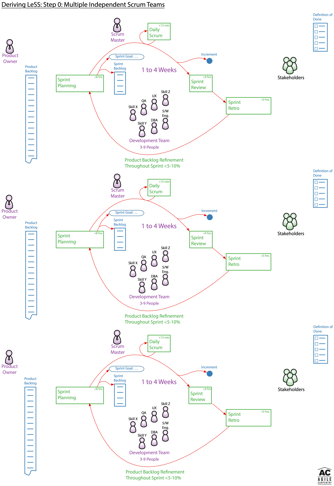

# Deriving LeSS: Step 1: Single Product Owner and Single Product Backlog

To ensure a single common vision and direction it is important to have a single Product Owner. Similarly, to ensure transparency as to what what PBIs are the most important regardless of which development team may do the work, it only makes sense to have a single common Product Backlog.

## Relevant LeSS Rule

* **There is one Product Owner and one Product Backlog for the complete shippable product.**

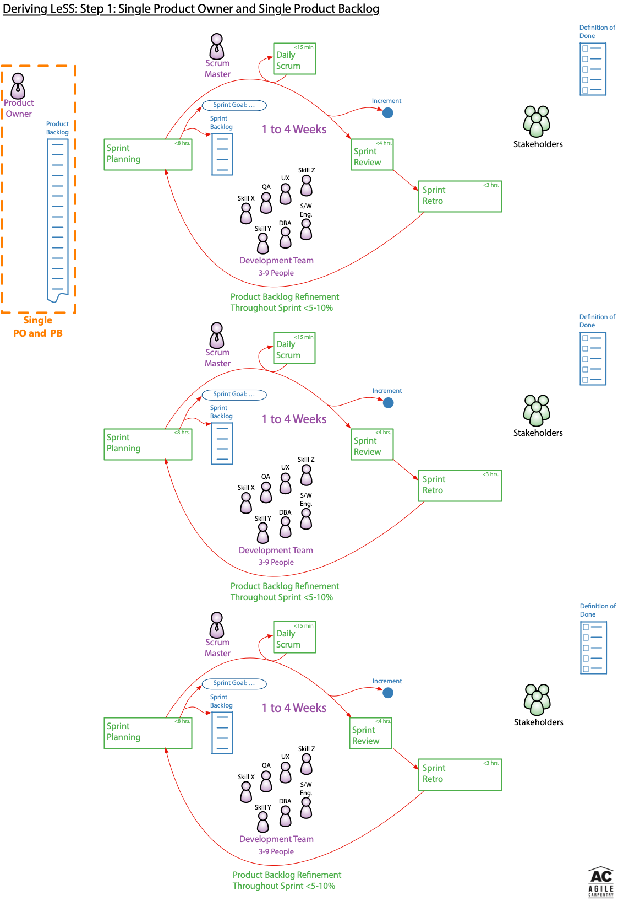

# Deriving LeSS: Step 2: Single Product-Level Sprint and Common Increment

Delivering value to the stakeholders requires there be a complete Increment which combines all the completed work from every team while including all the valuable functionality from previous increments. All the reasons for this in single team Scrum are equally valid with multiple development teams. In a pure software engineering context this is typically achieved by going even further and ensuring the entire codebase is always continually integrated while simultaneously being continually shippable. Only by continually producing a shippable fully integrated increment is it possible to drive sufficient coordination between all the development teams and to squeeze out the majority of the technical risk.

## Relevant LeSS Rule

* **There is one product-level Sprint, not a different Sprint for each Team. Each Team starts and ends the Sprint at the same time. Each Sprint results in an integrated whole product.**

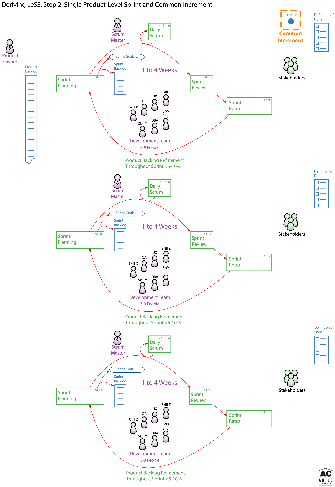

# Deriving LeSS: Step 3: Common Definition of Done

As teams work to create a common fully integrated increment they must have a shared understanding of what quality standard they are working to. Without such a shared agreement, any development team with a much lower quality standard than others will be in conflict with other development teams working on the same product. The obvious solution is for the development teams to work out a common quality standard they all agree to achieve or surpass.

You will notice the LeSS rules allow for a development team to have an even stronger Definition of Done which expands the common one. This is sometimes useful when one development team is trying out a new practice or technology before cross-training everyone else on the new practice or technology. In practice the development team specific Definition of Done extensions tend to be extremely short or non-existent.

## Relevant LeSS Rules

* **One Definition of Done for the whole product, common for all teams.**

* **Each team can have their own stronger Definition of Done by expanding the common one.** 

* **The perfection goal is to improve the Definition of Done so that it results in a shippable product each Sprint (or even more frequently).**

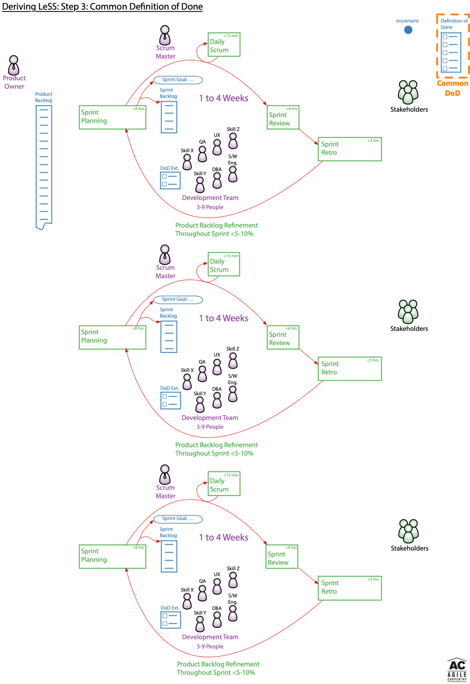

# Deriving LeSS: Step 4: Common Sprint Review

We now have a common Increment taken to a common Definition of Done, and a single common Product Backlog representing the product direction of a single Product Owner. The Stakeholder’s perspectives don’t change based on which development team happened to work on a specific PBI from the Product Backlog. It only makes sense for everyone in the Product Development Group and the Stakeholders to collectively review the Increment, discuss upcoming plans, and explore any changes in the market conditions in a single event. Therefore a single common Sprint Review is the natural choice, and exactly what LeSS does.

# Relevant LeSS Rule

* **There is one product Sprint Review; it is common for all teams. Ensure that suitable stakeholders join to contribute the information needed for effective inspection and adaptation.**

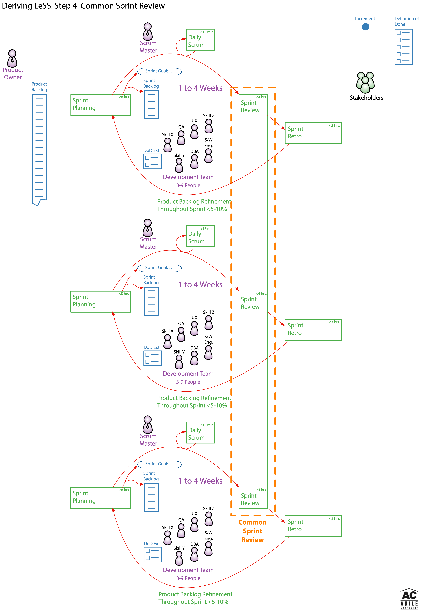

# Deriving LeSS: Step 5: Coordinated Sprint Planning

During Sprint Planning each self-managing, cross-functional, co-located, and long-lived team has a need to plan out it’s own work with enough fine grained detail to feel confident in their Sprint forecast. So it stands to reason that each development team needs its own Sprint Planning event to do this detailed planning.

In addition to the detailed planning by each development team, the development teams and Product Owner must do some initial overall coordination to figure out which teams are going to work on which PBIs. An initial event to do this overall coordination makes perfect sense.

As each development team performs their detailed planning they are very likely to discover aspects which require additional coordination with one or more of the other teams.

Interestingly, the ability to decide which team is going to work on which item requires that all teams are familiar with all of the PBIs towards the top of the Product Backlog. Hence the necessity of Multi-Team Product Backlog Refinement (PBR) which is discussed in Step 8.

The flexibility to wait until Sprint Planning for the teams to decide which team is going to work on which PBI is further enabled by reduced specialization. In other words, the LeSS structure naturally pushes teams in the direction of developing whatever skills are required to most effectively deliver the greatest value possible.

Once again, the LeSS framework’s approach to Sprint Planning aligns very naturally with all of the above considerations.

## Relevant LeSS Rules

* **Sprint Planning consists of two parts: Sprint Planning One is common for all teams while Sprint Planning Two is usually done separately for each team. Do multi-team Sprint Planning Two in a shared space for closely related items.**

* **Sprint Planning One is attended by the Product Owner and Teams or Team representatives. They together tentatively select the items that each team will work on that Sprint. The Teams identify opportunities to work together and final questions are clarified.**

* **Each Team has their own Sprint Backlog.**

* **Sprint Planning Two is for Teams to decide how they will do the selected items. This usually involves design and the creation of their Sprint Backlogs.**

## Other LeSS Rules

* **Structure the organization using real teams as the basic organizational building block.**

* **Each team is (1) self-managing, (2) cross-functional, (3) co-located, and (4) long-lived.**

* **The majority of the teams are customer-focused feature teams.**

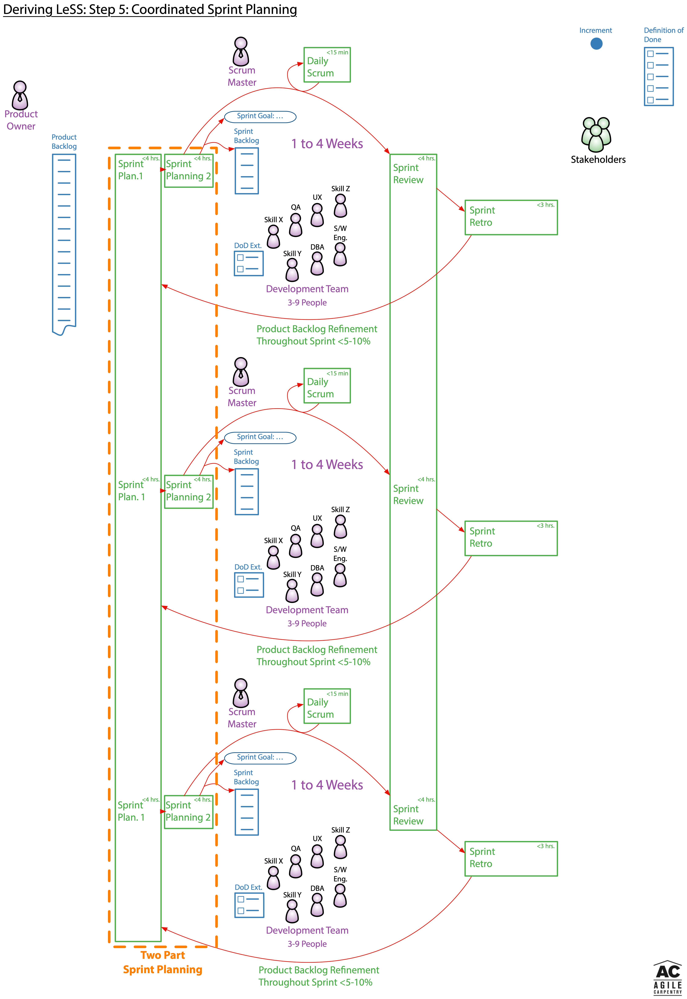

# Deriving LeSS: Step 6: Team-Level and Overall Retrospective

Each self-managing development team will inevitably have a variety of issues specific to their team to discuss and determine how to improve upon. So it makes sense each development team will need its own team level retrospective. At the same time each development team is collaborating with others to produce a single combined Increment meeting the common Definition of Done. So it makes sense there needs to be some sort of cross-team retrospective. In some cases it might even make sense to occasionally have retrospectives of everyone at a given location, or other similar boundary.

To ensure any team level retrospectives are not overly distracted by overall concerns from other teams, it is helpful to conduct team level retrospectives before an overall retrospective. This also helps the individual teams to clarify their thoughts a bit before a discussion with a broader group.

The LeSS framework’s prescription for addressing both intra-team and cross-team retrospective needs is to have team level retrospectives followed by an overall retrospective. If you carefully read the LeSS books you will also find the suggestion to occasionally run retrospectives at other scopes as well when it makes sense to do so. 

Again, no rocket science just the natural thing to do.

# Relevant LeSS Rules

* **Each Team has their own Sprint Retrospective.**

* **An Overall Retrospective is held after the Team Retrospectives to discuss cross-team and system-wide issues, and create improvement experiments. This is attended by Product Owner, Scrum Masters, Team representatives, and managers (if any).**

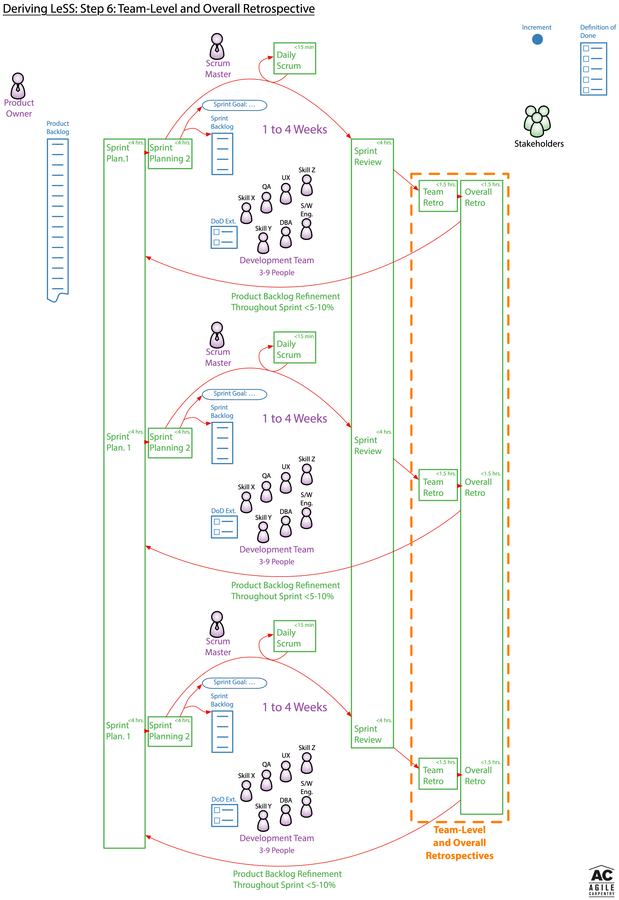

# Deriving LeSS: Step 7: Shared Full Time Scrum Masters

Single team Scrum is not perspective as to whether the Scrum Master is a fully dedicated role or not. LeSS takes the position the Scrum Master workload with multiple teams is enough to benefit from requiring the Scrum Master role to be a full-time role serving no more than three teams. 

Once the teams have been up and running for a few sprints the Scrum Master workload with multiple teams tends to come from the challenges of continually working to address more systemic organizational issues. It is important to remember each self-managing development team is managing it’s own work, the Scrum Master is not a project manager role. 

The LeSS rules regarding Scrum Masters are largely a result of empirical experience rather than self-evident easily derived rules such as having a single Increment and a common Definition of Done. That said, they are very sensible. Failure to follow them generally results in otherwise avoidable problems.

## Relevant LeSS Rules

* **Scrum Masters are responsible for a well-working LeSS adoption. Their focus is towards the Teams, Product Owner, organization, and development practices. A Scrum Master does not focus on just one team but on the overall organizational system.**

* **A Scrum Master is a dedicated full-time role.**

* **One Scrum Master can serve 1-3 teams.**

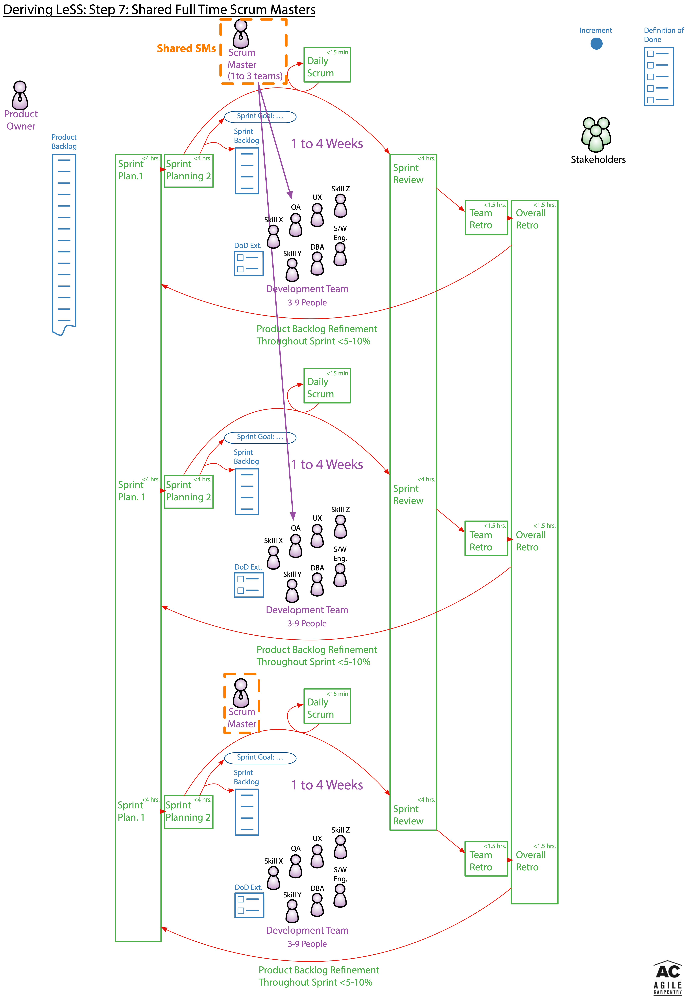

# Deriving LeSS: Step 8: Multi-Team Product Backlog Refinement

With every development team working from a single Product Backlog it often takes just a little more structure to effectively coordinate the refinement. It very often makes sense to have multiple teams perform the refinement together in a large room, ensuring any stakeholders useful to the PBIs being refined are also there. Although this ideally involves all teams in the product development group, this is sometimes difficult if there are teams in several different locations with large time zone differences. The Large Scale Scrum: More with LeSS book contains several Guides dealing with how to approach refinement in practice. 

Single team Scrum refinement often involves clarification of requirements along with a bit of design. With a larger number of teams it is useful to separate Product Backlog refinement and design. LeSS guides suggest multi-team product backlog refinement focusing on clarification of requirements with customers and/or other stakeholders, along with separate multi-team design workshops to deal with design aspects which don’t require significant customer input. You will also see reference to the idea of using an Overall PBR to figure out which teams are likely to implement specific PBIs and therefore select those items for later in-depth single team PBR.

To avoid overly restricting product development groups the formal LeSS rules are a bit more lax than the LeSS guides. Aside from adding "Multi-Team" to the text about refinement there are no changes to the diagrams in this step.

## Relevant LeSS Rules

* **Product Backlog Refinement (PBR) is preferably done with multiple teams to increase shared learning and to exploit coordination opportunities.**

* **The Product Owner shouldn’t work alone on Product Backlog refinement; she is supported by the multiple Teams working directly with customers/users and other stakeholders.**

* **All prioritization goes through the Product Owner, but clarification is as much as possible directly between the Teams and customer/users and other stakeholders.**

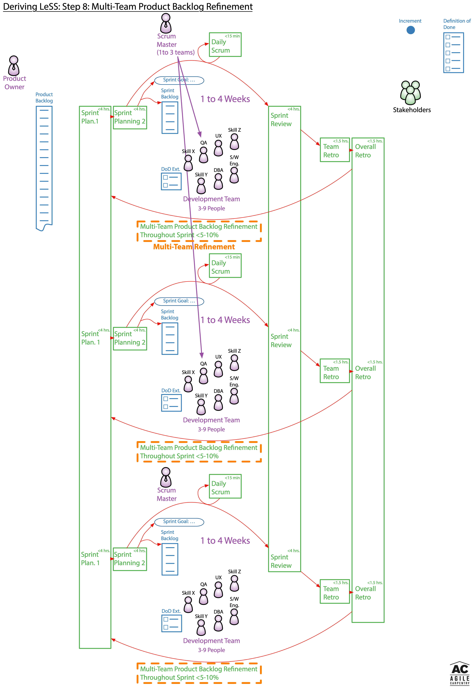

# Deriving LeSS: Step 9: Team Nomenclature and Team Size

## Team Nomenclature

With the introduction of LeSS some of the boundaries seen in the 2017 Official Scrum Guide become ambiguous. For example, within the 2017 Scrum Guide the Scrum Team is composed of the Product Owner, Scrum Master, and Development Team. With Scrum Masters potentially serving up to three teams the definition of a Scrum Team becomes a bit murky.

The majority of the teams within LeSS are customer focused teams. The emphasis on feature teams within LeSS is so strong that you will often see feature team and team used somewhat interchangeable. You will very seldom see the use of Development Team within the LeSS books and LeSS website.

The diagram has therefore been further modified to change Development Team to Feature Team to be more consistent with typical LeSS nomenclature.

## Team Size

The greater the number of teams, the greater the coordination burden. Therefore, with a co-located group of developers a single Scrum team with six developers is generally a more reasonable choice than having two teams of three developers in a LeSS framework. LeSS therefore suggests LeSS feature teams generally range between five to nine people. As with the Scrum Guide these are general guidelines more than a hard rule, you will even see a slight variation in the upper limit within the LeSS books and literature.

## Definitions

*Team*=Identical to the Development Team in the 2017 Official Scrum Guide. This is the self-managing team of developers responsible for turning the PBIs in their respective Sprint Backlog into functionality contained in the Increment in a manner which satisfies the Definition of Done. Both a Feature Team and a Component Team can be referred to as a Team in LeSS. The LeSS definition of Team does NOT include the Product Owner or Scrum Master.

*Feature Team*=A Development Team with all the skills and resources to develop a complete end to end customer feature.

*Component Team*=A Development Team which is only capable of working on a component of the Product.

*Product Development Group*=Everyone involved in product development including the Product Owner, Scrum Masters, members of every team, any relevant managers, anyone working in the “Undone” department, and anyone else involved in product development. The Product Development Group term does NOT include the Stakeholders.

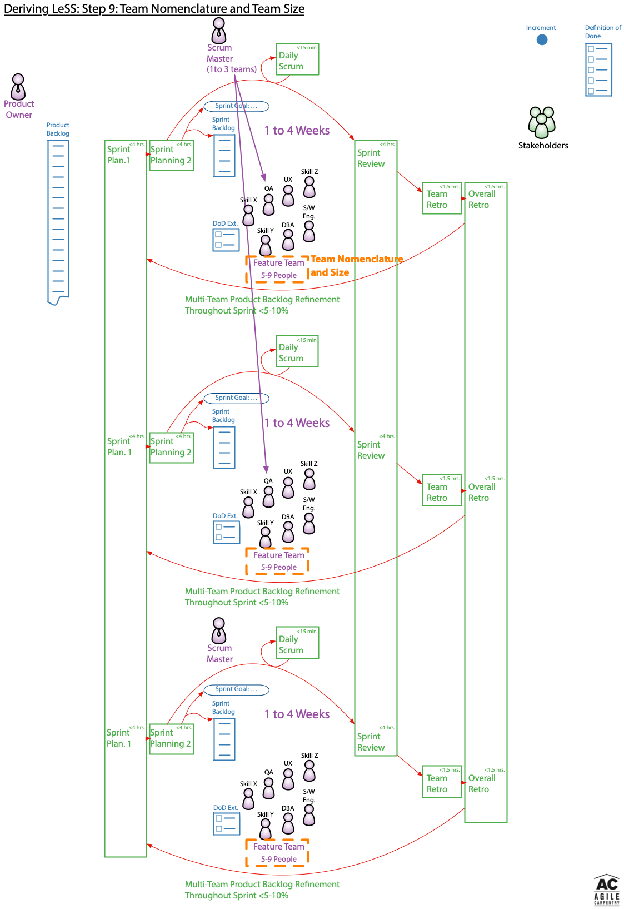

# Deriving LeSS: Step 10: Other Rules

LeSS is Scrum. LeSS provides adds additional constraints to Scrum, yet it doesn’t violate anything within Scrum as it does so.

With this in mind it is interesting to review a few more of the LeSS rules. A few of these simply reinforce what is already in the Official Scrum Guide. Others are not specifically required by the Official Scrum Guide yet they correspond to well known suggested practices for professional Scrum teams.

The most interesting group of additional LeSS rules relate to aspects on which the Scrum Guide is intentionally silent. Unlike many other approaches to adopting Scrum in larger scale contexts, LeSS fully appreciates the influence of broader organizational structure on culture and works to address it head on. Understanding these additional LeSS rules and the reasoning behind them is critical to a full appreciation of LeSS. 

Since this set of diagrams has been focused on deriving the meta-process aspects of LeSS from those of single team Scrum, they don’t effectively highlight the last group of LeSS rules.

## LeSS Rules Mirroring Scrum Guide

* **Each Team has their own Sprint Backlog.**

* **Each Team has their own Daily Scrum.**

## LeSS Rules Aligned with Professional Scrum Practices

* **Structure the organization using real teams as the basic organizational building block.**

* **Each team is (1) self-managing, (2) cross-functional, (3) co-located, and (4) long-lived.**

* **The majority of the teams are customer-focused feature teams.**

* **Cross-team coordination is decided by the teams. Prefer decentralized and informal coordination over centralized coordination. Emphasize Just Talk and informal networks via communicate in code, cross-team meetings, component mentors, travelers, scouts, and open spaces.**

## LeSS Rules Not Covered In These Diagrams

* **In LeSS, managers are optional, but if managers do exist their role is likely to change. Their focus shifts from managing the day-to-day product work to improving the value-delivering capability of the product development system.**

* **Managers’ role is to improve the product development system by practicing Go See, encouraging Stop & Fix, and “experiments over conformance.”**

* **For the product group, establish the complete LeSS structure “at the start”; this is vital for a LeSS adoption.**

* **For the larger organization beyond the product group, adopt LeSS evolutionarily using Go and See to create an organization where experimentation and improvement is the norm.**

* **The definition of product should be as broad and end-user/customer centric as is practical. Over time, the definition of product might expand. Broader definitions are preferred.**

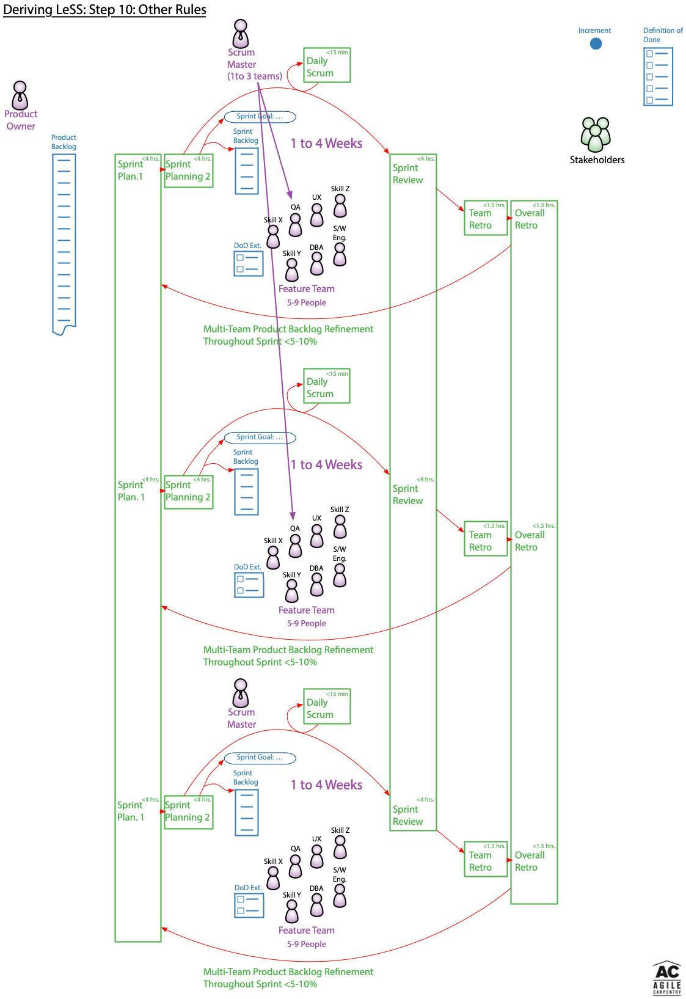

# Deriving LeSS: Summary Diagram

Now that you have seen how to derive the LeSS framework step by step, it is time to compare my summary diagram with the one from the LeSS website. I believe you will find it maps perfectly.

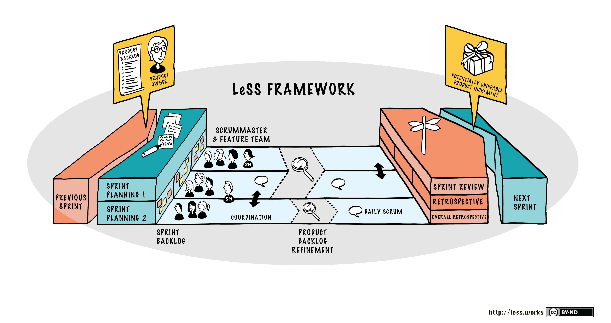

# LeSS Rules Summary

Rather than copy them here, I suggest you review the summary of the LeSS rules found on the LeSS website at: [https://less.works/less/rules/index](https://less.works/less/rules/index)

# Examining LeSS Huge

In my follow-on [Examining LeSS Huge](./ExaminingLeSSHuge) article I explore LeSS Huge. Less Huge is only relevant for extremely large product development groups, typically those with eight or more teams.

# How May I Help?

If you are trying to understand if LeSS is appropriate for your own organization, please let me know and we can schedule some time to talk. I have played a leadership role in two LeSS Huge transformations as an external independent consultant. As you can see from my LinkedIn profile I'm not your usual fluffy agile sprinkles coach, rather a seasoned (yet rusty) software engineer with a great deal of leadership and meaningful agile transformation experience.

For more serious inquiries I can share a draft LeSS case study for work I did at a past networking hardware client. My case study is not yet published on the LeSS website as I am working through various edits with Viktor Grgic and soon Craig Larman and Bas Vodde. I believe you will find my case study, book, and references will make it very easy to evaluate my ability to help you. My LinkedIn recommendations from Trevor Gamba, Dmitry Barsky, and David Stackleather are some of the more insightful ones.

Contact details can be found on the [Agile Carpentry](https://agilecarpentry.com) website.