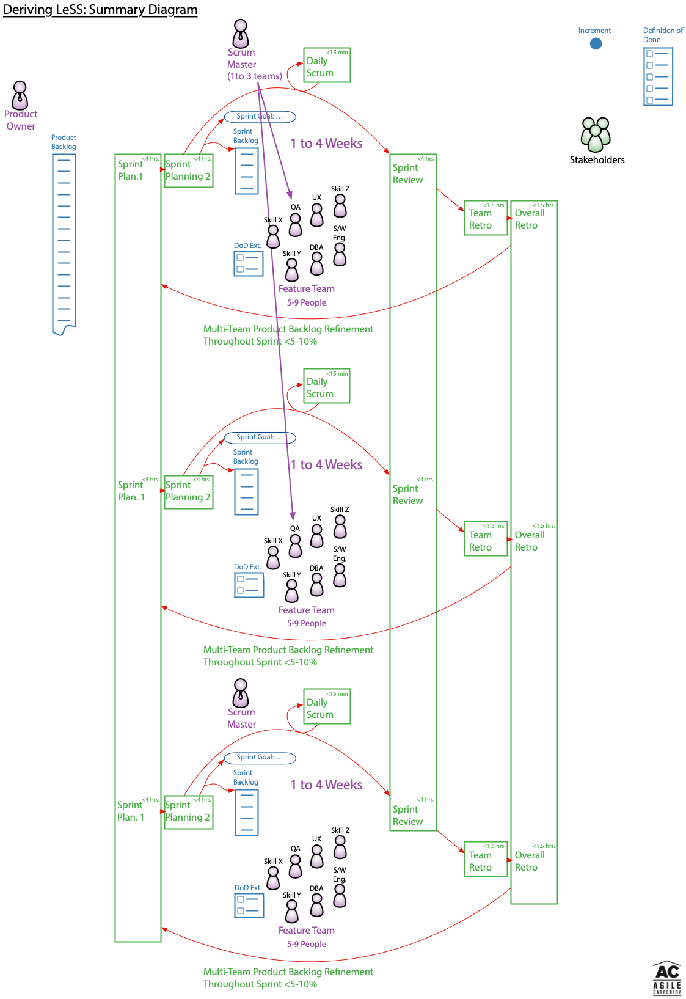
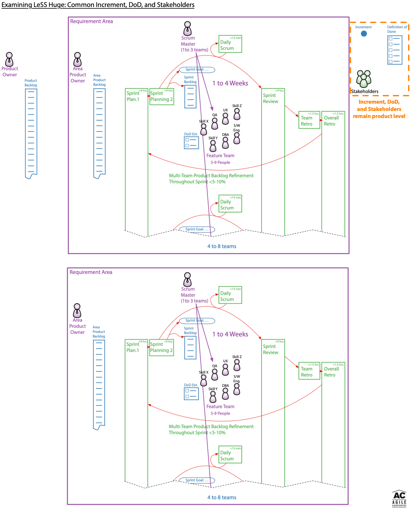
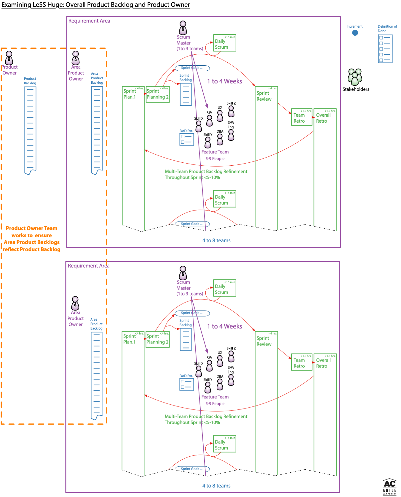
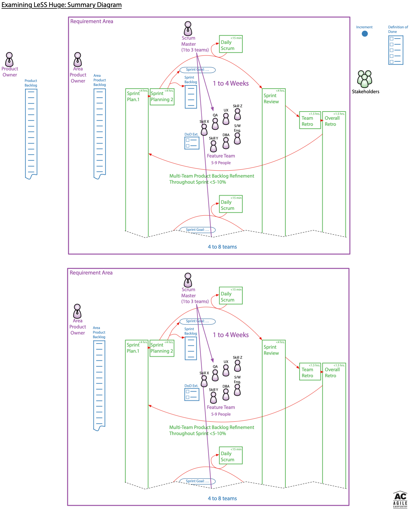
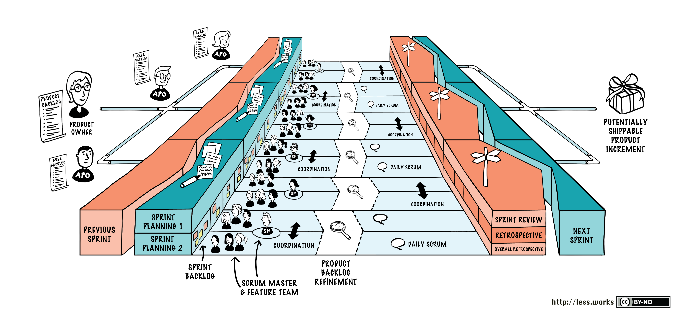

# Examining LeSS Huge

In an earlier [Deriving LeSS](./DerivingTheLeSSFramework) article I showed how the LeSS Framework's roles, events, and artifacts can be very naturally derived from single team Scrum. With each step the associated LeSS rules were listed. This article is intended to extend the conversation so as to explain the extension of the LeSS Framework into the LeSS Huge Framework.

At some scale the number of teams and breath of a product become so large as to be more than a single Product Owner can manage. With healthy mature teams actively enrolled in product backlog refinement you may be able to sustain as many as a dozen teams using the LeSS Framework alone. It is wise to avoid implementing LeSS Huge if at all possible given the additional information scatter and attendant risks to adaptability and customer value which will likely occur.

LeSS places a great deal of focus on addressing the underlying organizational structure necessary to establish a supportive culture. LeSS also assumes and requires excellent engineering practices. As with my [Deriving LeSS](./DerivingTheLeSSFramework) article those critical details are not covered here; the focus is purely on the events, roles, and artifacts of the LeSS Huge Framework. The [LeSS website](https://less.works) as well the three [LeSS books](https://less.works/resources/learning-resources/books) written by Craig Larman and Bas Vodde provide far more detail than is available in this short and extremely narrow article.

# Review of Earlier LeSS Framework Diagrams

The LeSS Huge Framework is derived from the LeSS Framework by adding Requirement Areas and associated Area Product Owners. The changes are relatively simple, so rather than try to incrementally derive LeSS Huge from LeSS I will simply show the LeSS Huge Framework and highlight a few key observations.

The completed version of my LeSS Framework diagram from the previous article is shown below. The subsequent diagrams will examine the LeSS Huge Framework in comparison to the LeSS Framework.

# Examining LeSS Huge: Common Increment, DoD, and Stakeholders

Regardless of the number of teams involved, there is still only a single product. The Increment and Definition of Done are therefore common across all teams regardless of Requirement Area. Similarly, at least some of the Stakeholders will be interested in features implemented by teams from various Requirement Areas.

Although LeSS suggests common Sprint Reviews across Requirement Areas when possible, it is careful not to require them. LeSS recognizes separate Requirement Areas are likely to need their own Sprint Reviews once a single Sprint Review becomes unsustainably large.

# Examining LeSS Huge: Overall Product Backlog and Product Owner

At some scale the overhead of keeping a single fine grained Product Backlog becomes more than a single person can manage, even with the teams doing most of the clarification. When this scale is finally reached LeSS Huge becomes necessary.

The Product Owner still provides overall direction and determines high level priorities in the Product Backlog. The Area Product Owners in collaboration with their respective teams and relevant Stakeholders maintain finer grained detail in their respective Area Product Backlogs, while making sure to keep them in sync with the overall Product Backlog. 

# Examining LeSS Huge: Summary Diagram

Here is my LeSS Huge summary diagram, along with the equivalent LeSS Huge diagram from the LeSS website. Although my diagrams are designed to be easy to scrawl on a whiteboard, the diagrams from the LeSS website are more space efficient. The online LeSS website versions are also nicely hyperlinked so you can obtain more detail on any particular aspect you wish.

# LeSS Huge Framework Rules

As you can see from the diagrams above, the LeSS Huge Framework is a rather straightforward extension of the LeSS Framework. It now makes sense to review the LeSS Huge specific rules which LeSS adds on top of the underlying LeSS Framework rules.

The LeSS Huge rules below are coped verbatim from the rules summary on the LeSS website. Please read and reflect on them carefully, while concurrently examining the diagrams above.

# Verbatim Copy: LeSS Huge Framework Rules

LeSS Huge applies to products with “8+” teams. Avoid applying LeSS Huge for smaller product groups as it will result in more overhead and local optimizations.

All LeSS rules apply to LeSS Huge, unless otherwise stated. Each Requirement Area acts like the basic LeSS framework.

## LeSS Huge Structure

* Customer requirements that are strongly related from a customer perspective are grouped in Requirement Areas.

* Each Team specializes in one Requirement Area. Teams stay in one area for a long time. When there is more value in other areas, teams might change Requirement Area

* Each Requirement Area has one Area Product Owner.

* Each Requirement Area has between “4-8” teams. Avoid violating this range.
LeSS Huge adoptions, including the structural changes, are done with an evolutionary incremental approach.

* Remember each day: LeSS Huge adoptions take months or years, infinite patience, and sense of humor.

## LeSS Huge Product

* One (overall) Product Owner is responsible for product-wide prioritization and deciding which teams work in which Area. She works closely with Area Product Owners.

* Area Product Owners act as Product Owners towards their teams.

* There is one Product Backlog; every item in it belongs to exactly one Requirement Area.

* There is one Area Product Backlog per Requirement Area. This backlog is conceptually a more granular view onto the one Product Backlog.

## LeSS Huge Sprint

* There is one product-level Sprint, not a different Sprint for each Requirement Area. It ends in one integrated whole product.

* The Product Owner and Area Product Owners synchronize frequently. Before Sprint Planning they ensure the Teams work on the most valuable items. After the Sprint Review, they further enable product-level adaptations.

# How May I Help?

If you are trying to understand if LeSS is appropriate for your own organization, please let me know and we can schedule some time to talk. I have played a leadership role in two LeSS Huge transformations as an external independent consultant. As you can see from my LinkedIn profile I'm not your usual fluffy agile sprinkles coach, rather a seasoned (yet rusty) software engineer with a great deal of leadership and meaningful agile transformation experience.

For more serious inquiries I can share a draft LeSS case study for work I did at a past networking hardware client. My case study is not yet published on the LeSS website as I am working through various edits with Viktor Grgic and soon Craig Larman and Bas Vodde. I believe you will find my case study, book, and references will make it very easy to evaluate my ability to help you. My LinkedIn recommendations from Trevor Gamba, Dmitry Barsky, and David Stackleather are some of the more insightful ones.

Contact details can be found on the [Agile Carpentry](https//agilecarpentry.com) website.
