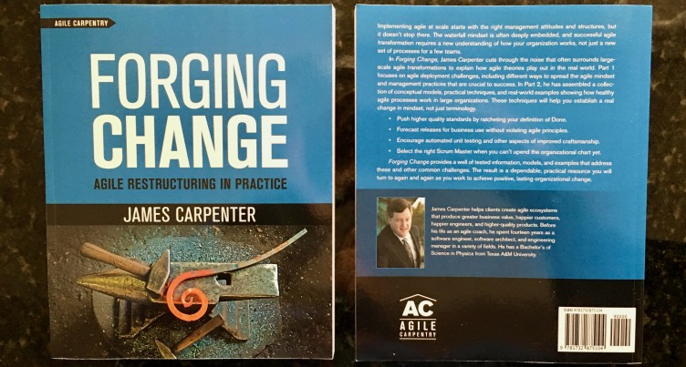

# Using Structure to Mold Culture

Truth is often multifaceted, especially in the complex work of changing the culture of engineering organizations. Often, the more actionable, insightful facets are obscured by more politically palatable aspects with broader marketing appeal. This doesn’t necessarily make the politically palatable aspects any less true; they simply don’t provide a complete understanding.

# Structure Drives Ground-Level Culture

At a high level there are at least two key leadership facets to agile adoption. Let’s call the first *cultural leadership* and the second *structural leadership*. You will quickly recognize cultural leadership as the usual wisdom espoused in almost every management book. In contrast, structural leadership is very uncomfortable for many to discuss and therefore seldom given the emphasis and exposure it deserves.

## Cultural Leadership

Cultural leadership refers to the insightful yet seldom controversial material you are likely already aware of. In many cases it is a bit too abstract to apply directly, unless something you read just happens to resonate with a specific challenge you are experiencing at that time.

**Leadership Must Lead.** Executive management has an ethical and professional responsibility to establish clarity of organizational purpose, validate high-level mission intent, and model desired cultural values.

**Management Books and Related Content.** Much has been written on cultural leadership:

* Various books by Dale Carnegie

* Various books by W. Edwards Deming

* *Great by Choice* by Jim Collins and Morten T. Hansen

* *Tribal Leadership: Leveraging Natural Groups to Build a Thriving Organization* by Dave Logan, John King, and Halee Fischer-Wright

* *How Google Works* by Eric Schmidt and Jonathan Rosenberg

* *Turn the Ship Around!* by L. David Marquet

* *Drive: The Surprising Truth About What Motivates Us* by Daniel H. Pink

* The Agile Manifesto (http://agilemanifesto.org/)

Cultural leadership is critical, and yet still insufficient to uproot legacy culture and replace it with a more effective culture aligned with an agile value system.

## Structural Leadership: Management Broke It, Only Management Can Fix It

In my experience, ground-level culture is driven by structure far more often than structure is driven by ground-level culture. Many large organizations spend a lot of time talking about agility, transparency, and other grand ideals; yet the experience in the trenches remains rather oppressive and fails to model any of the ideals being espoused. Appropriate structural change produces radically different outcomes, with significant cultural change within a matter of a few months if not a few weeks.

There are several process frameworks aligned with an agile value system, any of which can provide a clear road map for better aligning structure to the nature of complex engineering work. One of the more successful approaches is Scrum with Extreme Programming–style engineering craftsmanship practices. Unfortunately, Scrum is frequently distorted, abused, and then maligned by management to obscure the underlying organizational problems Scrum exposed. The difference between successful and unsuccessful change efforts can often be traced back to how much executive management understood and actively supported the effort.

Most of the problems I see in practice have very little to do with lack of cultural leadership at the executive level. Instead, I see managers without any appreciation for or understanding of empirical process control, whose negative behaviors are reinforced by preexisting structural forces established and promoted by executive management. In other words, **management broke the organization and only management can fix it**.

## Structural Leadership: Using Structure to Mold Culture

An executive manager who wishes to radically transform organizational culture must implement structure and metrics that hold managers accountable to an agile value system. Without appropriate structure and metrics, a significant number of managers will rapidly distort intentions in an effort to protect themselves from the emotional challenges of changing their behavior.

I am a strong believer in using the carrot more than the stick to motivate behavioral change. People generally rise to your expectations; expect the best and you will usually get it. Unfortunately, the legacy behaviors and personal value systems of about a third of managers are usually too deeply entrenched for the carrot alone to work. Consequently, it is important to implement accountability mechanisms that ensure a manager’s personal pain of not changing is greater than the personal pain of changing. In my experience, unless an executive sponsor is willing and able to fire people there won’t be enough leverage to uproot the preexisting culture.

## Structural Leadership: Executive Values Drive Structure

When using shorthand, I frequently say structure drives culture. This is not completely accurate. Working backward a bit:

* **Current Organizational Problems**

* result of: **Current Organizational Structure**

* result of: **Poor Executive Management Decisions**

* result of: **Lack of Understanding in the Executive Layer**

From this perspective, even failures in structural leadership are the result of failures in cultural leadership. If you don’t believe there is a general lack of understanding in the executive layer regarding the nature of software engineering and similar complex work and how to best manage it, I challenge you to read the first chapter of [The Principles of Product Development Flow](http://lpd2.com/downloads/) by Donald G. Reinertsen.

You may insist the value system of executive leadership is the most critical thing. I agree. But this perspective does not clearly illuminate an actionable path to change. My primary interest is in affecting large-scale organizational change. Leaders can talk about organizational change and ideals all day long and nothing meaningful seems to happen. But adopting a structure aligned to agile values and then helping executive leadership hammer the organization into that mold inevitably yields rapid, positive change and produces radically happier customers, happier engineers, and higher-quality products.

## Structural Leadership: Helping Managers Accept Change

In a traditional organization doing predictable work, ground-level employees distill and refine information so those higher in the organizational chart can make an informed decision. The presumption is that those higher-ups are better placed to make a fully informed decision that accounts for all the constraints the organization faces. These managers provide value to the organization by striving to make the best decisions possible and providing clear, actionable guidance to employees working at the ground level.

In other words, managers in traditional organizations primarily obtain a sense of self-worth and importance by going to lots of meetings and making important decisions affecting those who report to them. In an agile organization the role of a manager is much different, and the source of a manager’s sense of self-worth must change.

Agile organizational design presumes that the work is far too complex for managers to make an ideal decision. Instead, agile managers are responsible for ensuring that those closest to the work have the information flows they need to make an optimal decision and removing any obstacles those closest to the work cannot remove by themselves. The sense of self-worth felt by agile managers is more like that of parents who are more proud of their children’s accomplishments than their own.

This is a gross oversimplification, but it highlights why some managers find their organization’s agile adoption so emotionally challenging to accept. In many ways middle management has far more to lose in an agile adoption than anyone else in the organization. They have spent years becoming good at things that are no longer highly valued. This is potentially terrifying, especially when you mix in concerns about providing for family and maintaining social standing.

I can make an argument that the emotional rewards and intellectual challenges for managers are greater in agile organizations than in traditional organizations. Even though this may be true, it still requires a leap of faith to give up a comfortable, well-understood situation for a much less familiar one.

Helping managers overcome their fears during an agile adoption requires both cultural and structural leadership from executive management. We must compassionately recognize the justifiable fears involved and help people develop the courage to move past them. At the same time, we must hold management accountable for change.

I believe that using traditional management techniques for complex project work such as software engineering effectively holds employees accountable for things outside their control. I also believe that executive management’s moral obligation to ensure ground-level employees are treated fairly supersedes the needs of their middle managers to feel emotionally comfortable. So while executive management should compassionately and patiently support middle managers in their transition to an agile model, any manager who isn’t making a good-faith effort to come into alignment must be actively moved out of the organization.

# Read More of Forging Change

The above article was adapted from my first chapter in [Forging Change](https://www.amazon.com/author/jamesleecarpenter). A more extensive preview is available via the *Look Inside* feature on Amazon, including an excellent foreword by David Stackleather.

*Forging Change* is available from most any bookstore in paperback, hard-cover, and e-book form. 

If you email me proof of purchase for any print version of the book, I will happily send you a digital copy as well. A photo of you with my book is more than sufficient proof.

A variety of per-chapter reference material and other details are available on the companion website.

