# LeSS-Huge Adoption Case Study

This is a handout for my
[LeSS-Huge Adoption Case Study](https://www.meetup.com/Large-Scale-Scrum-LeSS-Twin-Cities/events/275987580/) presentation at the Twin Cities LeSS Meetup.

# PDF of this Document

A PDF version of this document is available at: [http://forgingchange.com/mcs_case_study/DataCenterProductCompanyLeSSMeetupHandout.pdf](http://forgingchange.com/mcs_case_study/DataCenterProductCompanyLeSSMeetupHandout.pdf)

# Introduction

Dear LeSS Meeup Attendees:

The [Twin Cities LeSS Meetup](https://www.meetup.com/Large-Scale-Scrum-LeSS-Twin-Cities/) leadership team has graciously extended an opportunity for me to discuss my experience coaching a LeSS-like transformation within a division of a multi-national networking hardware company.

I am currently working through the [LeSS trainer licensing process](https://less.works/courses/become-less-trainer). A key component of the LeSS trainer licensing process is writting up a comprehensive case study detailing my experiences in a prior LeSS adoption. 

The natural product complexity, organizational scale, senior management turnover, and failure modes I experienced while working to transform a division of a networking hardware company make it a particularly compelling choice for a case study. The failures involved are easily as insightful as the successes. 

I am still working through the initial editorial process with Viktor Grgic. Subsequent to Viktor's generous efforts, Bas Vodde and Craig Larman will provide additional editorial insight and guidance. Once all this is done, the case study will eventually be published on the LeSS website.

To help you better follow my Twin Cities LeSS Meetup presentation, I have excerpted just the figures and their captions from my draft case study. Coupled with their captions, the figures the reveal the entire story arch of the Nakashima MCS divison's LeSS journey.

My intentions for the meetup presentation are to quickly walk through the figures you see here, and then to move to a collaborative discussion and Q&A format. It is my hope this will facilate deep meaningful learning opportunities.

Please read this content carefully prior to the meetup. The more prepared each of you are, the more meaningful our discussion is likely to be.

I recommend you consider printing out the timeline figure prior to meetup. It is easy to lose sight of the forest for the trees as you examine the various aspects detailed in each figure. Keeping the timeline handy -- perhaps making notes on it as you go -- will help you to understand how the other figures relate to the whole. To make this easy I am providing a [PDF version](http://forgingchange.com/mcs_case_study/DataCenterProductCompanyLeSSMeetupHandout.pdf) of everything you see here.

I have also invited the director of the BIOS group to join us. His case study pseudonym is Mitya. Mitya is a very seasoned senior manager with deep hands-on experience in the hardware and firmware world. I have tremedous professional respect for Mitya, who I first met while at Nakashima. I am also extremely fortunate to have been adopted as extended family by Mitya, his wife, and their child. Seldom is a road-warrior blessed to find such a supportive lifelong friend.

I look forward to seeing everyone and having a great conversation.

Sincerely,
James Carpenter
Executive Agile Coach/Owner
Agile Carpentry
Email: james at agilecarpentry.com
Website: http://agilecarpentry.com
Book: http://forgingchange.com

# Biographies

**James Carpenter**  is an experienced independent agile transformation coach, trainer, software engineer, and author who grew up on a Texas dairy farm. His coaching is grounded by the many years he spent as a hands-on software engineer and manager, along with a great deal of academic study, and in-the-trenches transformation work. He is focused on large LeSS and LeSS Huge organizational transformations. His book "Forging Change: Agile Restructuring in Practice" is available in both e-book and print formats from most bookstores including Amazon.

**Mitya (pseudonym)** is an extremely talented senior engineering manager. He has extensive hands-on experience as both a hardware and firmware engineer. He was a pivotal director level manager involved in the LeSS-Huge adoption being discussed. More concrete and glowing details have been omitted in an effort to protect the anonymity of the end client being discussed.

# Product Context
(Corporate policies restrict the usage of the actual company name. All names of individuals in this case study are also pseudo names.)

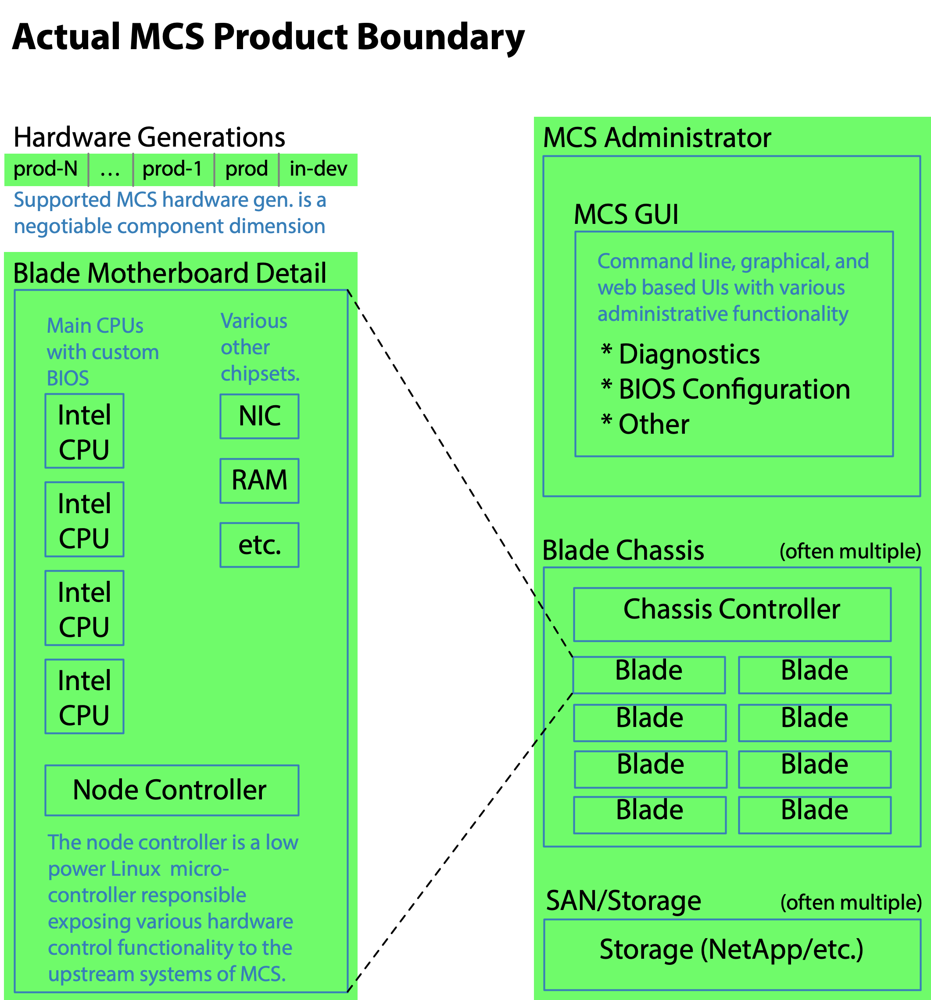
**Figure 1:** *From the perspective of the Product Management group, Nakashima divisional boundaries, and external customers the natural product boundary includes the entire system of network, compute, and storage capability.*

*Even broader product boundaries are possible but are not that practical as the coupling between other systems is sufficiently standardized to be interchangeable with data center hardware and software from a variety of vendors. These other systems do play a minor role in the larger scale testing scopes, but they are not the focus of Modular Compute System testing.*

# LeSS Adoption Timeline

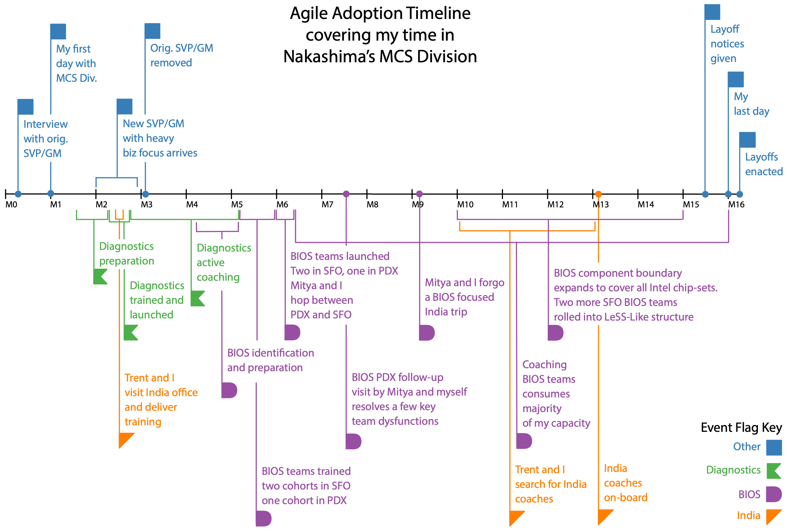
**Figure 2:** *With the various overlapping adoption efforts and managerial changes it is easy to lose track of the overall story arch. Hopefully, this timeline will help you keep track.*

# Diagnostic Showcase Team

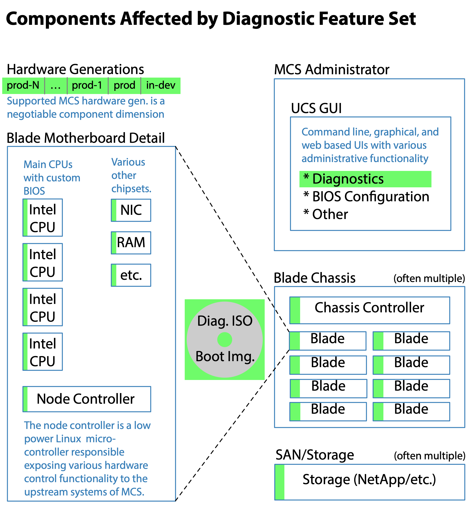
**Figure 3:** *Although the diagnostic code is largely encapsulated in a custom ISO image and some diagnostic focused code in the MCSA, the diagnostics capabilities are broadly focused and relevant to all hardware generations. Detailed knowledge of each component in the entire MCS system is often required. When a given MCS component’s firmware is missing the ability to probe it, the diagnostic team adds it.*

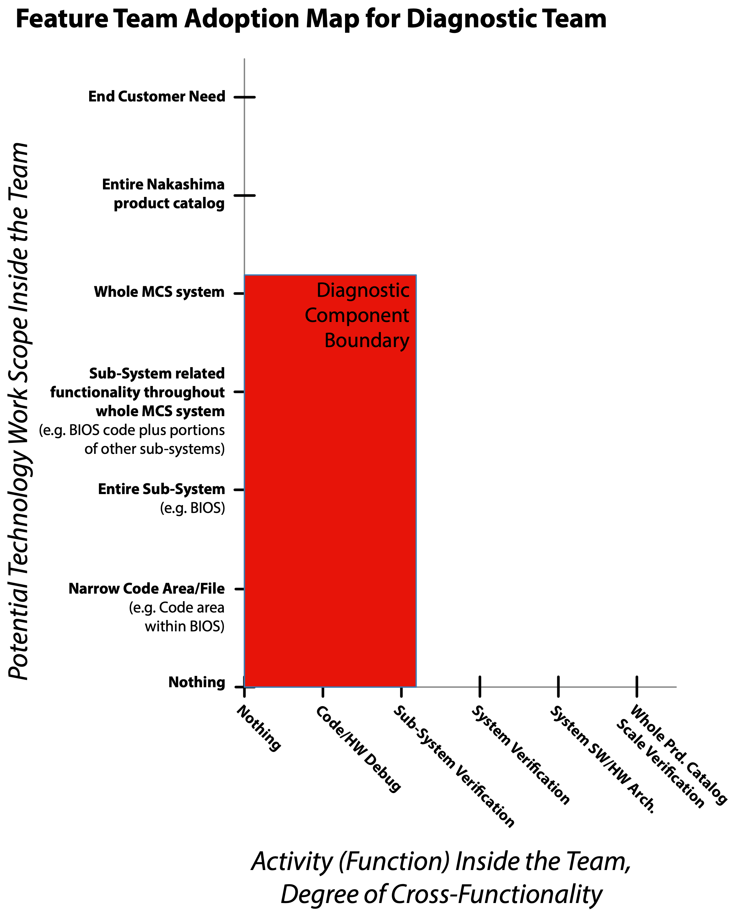
**Figure 4:** *The diagnostic capability is narrowly focused on helping customers diagnose problems with their on-site MCS systems, particularly hardware component failures. Although the focus is narrow the scope spans the whole MCS system.*

*More information on the usage of Feature Team Adoption maps can be found at:* [https://less.works/less/adoption/feature-team-adoption_map](https://less.works/less/adoption/feature-team-adoption_map)

## Dignostics Team Photo in Team Room

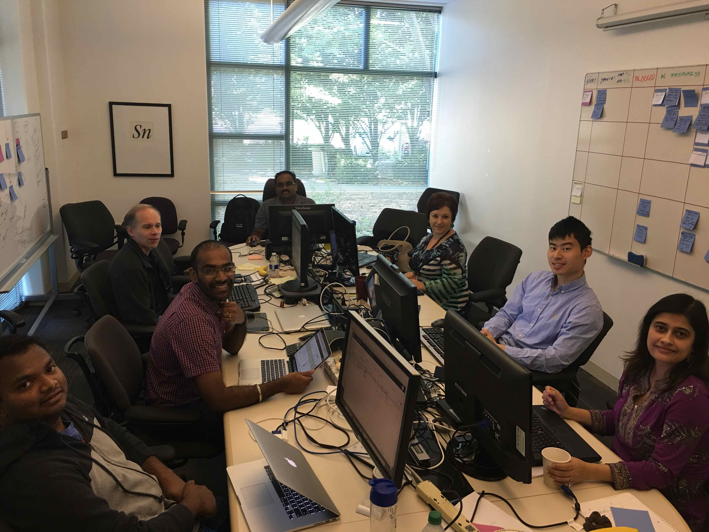
**Figure 5:** *Here is a photo of the diagnostics Scrum development team. Pairing and swarming became more common over time, mob programming never quite caught on. The team had both the test and software engineering talent needed to deliver a potentially shippable increment at the end of each Sprint. The development team used a physical scrum task board. The meeting room we took over was a bit smaller than we would have liked, a larger space was not initially available.*

## Diagnostics Definition of Done After Several Sprints

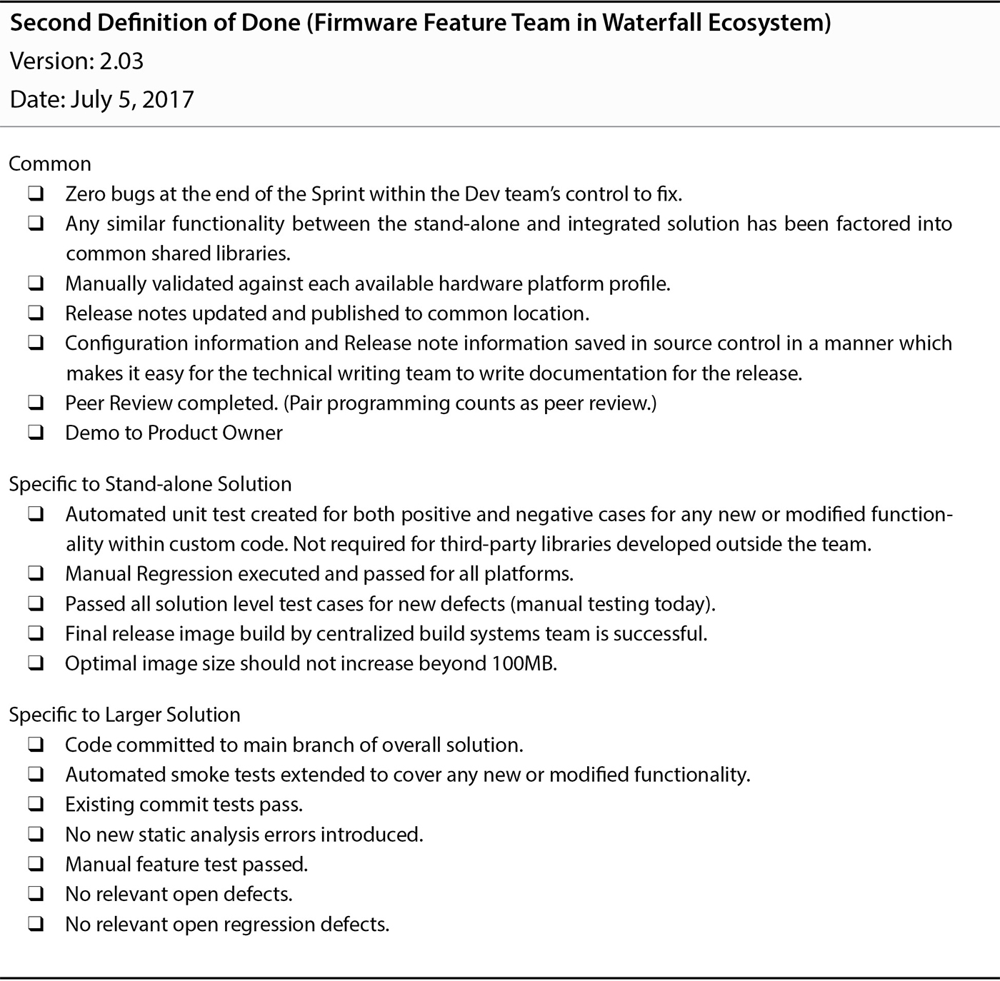
**Figure 6:** *The definition of Done used by the diagnostics team evolved to what you see here after a few sprints. The stand-alone portion of the Increment was provided to the field service division by the end of each Sprint. Providing the MCS integrated diagnostics capabilities to the end customer required waiting for a release of the waterfall developed MCS product. This example definition of Done along with additional context can be found in Table 9.2 of [Forging Change](http://forgingchange.com).*

## Slowly Transitioning from Component Teams

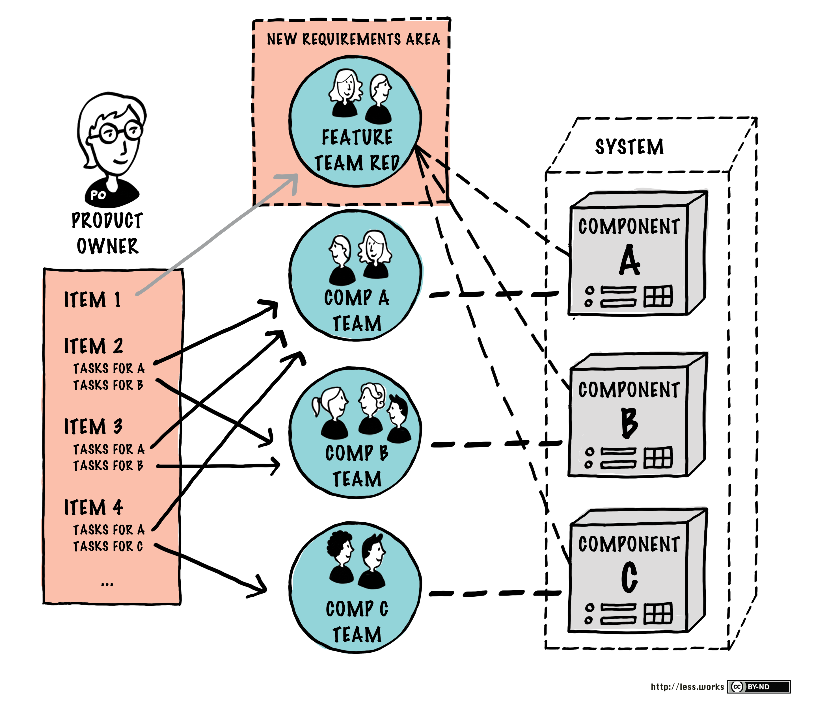
**Figure 7:** *You will find this diagram as Figure 4.11 in [Large Scale Scrum: More with LeSS](http://www.amazon.com/Large-Scale-Scrum-More-Craig-Larman/dp/0321985710) as part of the “Transitioning to Feature Teams” guide. You will notice Feature Team Red in its newly formed Requirement Area consumes from the same Product Backlog as do all the component teams. Although this loosely correlates to the diagnostic team situation, the day to day reality was slightly different.  The diagnostic team was a real self-managing team free from the negative direct effects of the contract game. In contrast, most of the other MCS teams were subject to the contract game within a waterfall delivery context.*

*The diagnostic team's organizational reporting relationships were never changed so as to intersect the organizational chart above the level at which the contract game was being played for the waterfall teams. This failure eventually resulted in the erosion of the supportive context required for the diagnostic team to remain successful. This failure became increasingly apparent after the departure of the original engineering SVP/GM.*

# BIOS LeSS-Like Adoption Context

**Figure 8:** *The initial BIOS component boundary only included the custom BIOS. Even at this narrower scope, it still included hundreds of specialized code areas within the custom BIOS itself and millions of lines of C code. Few if any of the several dozen BIOS engineers initially knew more than one or two aspects of the BIOS code.*

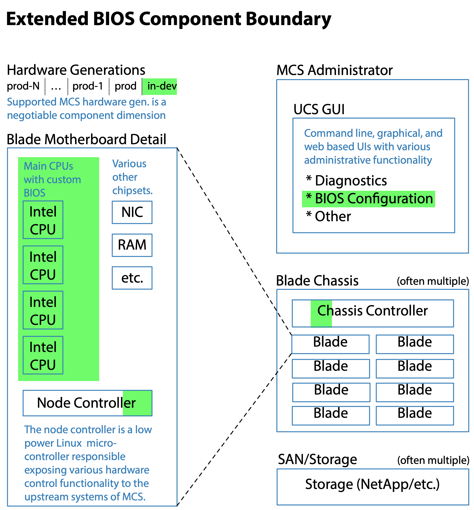
**Figure 9:** *A BIOS component boundary that included everything along the BIOS configuration control path would have been preferable. It would map to a natural product requirement area, and be easily understood by a Product Owner from the Product Management group.*

*Just prior to the mass layoffs, the BIOS teams managed to obtain buy-in from key members of the MCSA and the Node Controller waterfall MCS teams to start making smaller changes themselves. With greater senior leadership stability this could likely have been grown into a proper requirement area during MCS release planning for the subsequent generation Intel chipset. As part of this expansion, a real Product Owner from Product Management would then help facilitate even greater transparency and additional political leverage over time.*

**Figure 10:** *The BIOS developers were originally more of a loose group of a few dozen individuals who each specialized in a narrow aspect of the BIOS customization. The BIOS system alone contained millions of lines of code in an extremely esoteric system domain.*

## Churn in Senior Management Layer

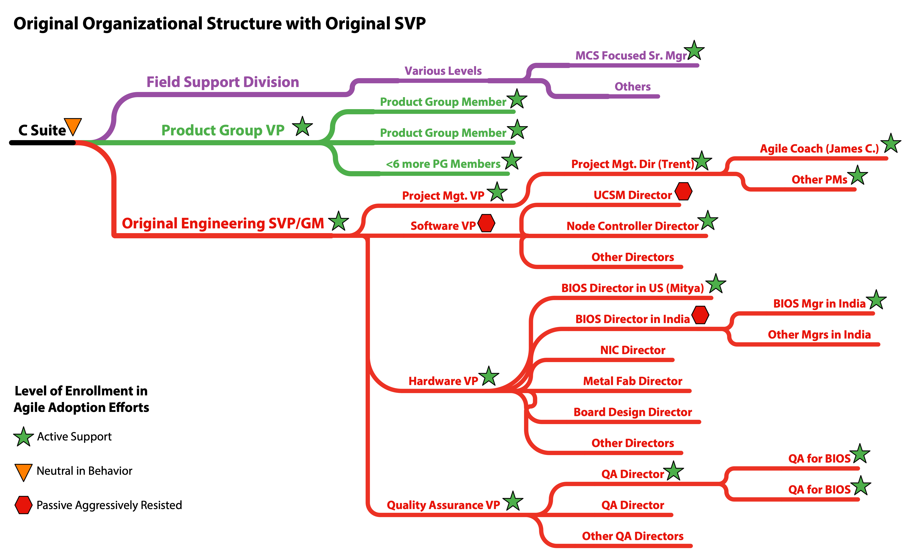
**Figure 11:** *The initial Sr. VP/GM of engineering for the MCS division was extremely supportive of the agile adoption efforts. I also found active support throughout much of the organization. A large number of directors, managers, and individual contributors provided active guidance as I attempted to better understand and help the organization. Unfortunately, this Sr. VP’s tenure was very short and there was a key VP responsible for the more pure software portions of the product who was passively aggressively opposed to any real change.*

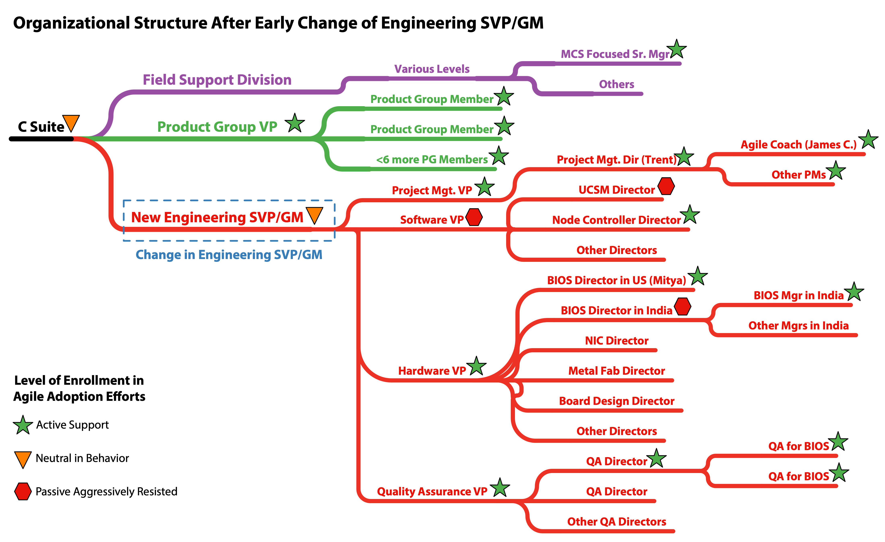
**Figure 12:** *The initial Sr. VP/GM of engineering of the MCS Division only had his role for a few months before I arrived. Within a couple months of my arrival he was replaced with another Sr. VP. In retrospect it is obvious the new Sr. VP’s direction from the C suite was to rationalize the size of the division. Although this new Sr. VP gave frequent lip service to agility both internally and externally, it was obvious he had little depth of understanding of agile fundamentals or interest in learning. Interestingly, this Sr. VP would likely have made a fantastic Product Owner given his grasp of the business domain. The new Sr. VP was almost completely unavailable to me and unwilling to actively engage in the agile transformation efforts. Although it generally happened outside of my view, I believe I continued to receive active support and air cover from the Project Management VP. Much of the political dynamics and motivations slowly revealed themselves over time and therefore are more easily discerned in retrospect than they were at the time. Although there were some additional organizational changes over time once the new engineering SVP took over, none were very significant to the teams attempting an agile adoption until the Hardware VP left.*

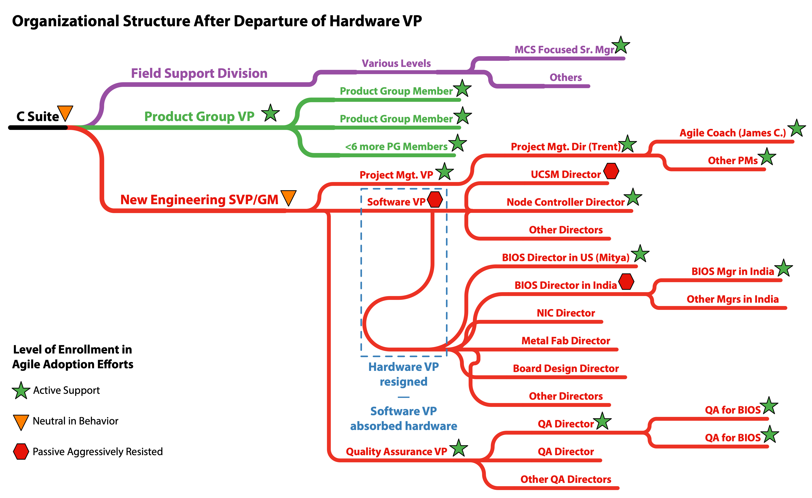
**Figure 13:** *Under the cloud of upcoming and active layoffs many people began to depart the organization voluntarily. Around the same time a new extremely well funded startup began to actively recruit some of the more skillful engineers and managers in the MCS division. One of these departures was the Hardware VP who the BIOS teams had reported through. The new engineering SVP chose not to backfill the Hardware VP but instead to have all those previously reporting up through the Hardware VP report through the Software VP. As the Software VP was always passively aggressively working against the agile adoption efforts this did not bode well. Over the course of a few months half the BIOS team members were laid off, my engagement ended, and Mitya followed the Hardware VP to the same well funded startup the Hardware VP had left for. A little over a year later, Trent also left Nakashima Incorporated.*

## People and Geography

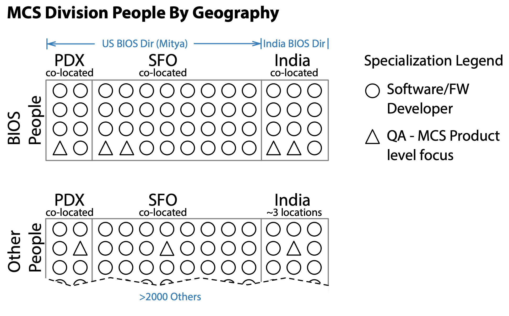
**Figure 14:** *The vast majority of the people within the MCS Division are co-located on one or two floors within a single building in their respective cities. We were careful to ensure BIOS team members were generally sitting within a few feet of their teammates. Workstations were generally friendly to swarming. Half the work occurred in lab space so many team members effectively had two working locations. With the exception of a handful of the QA specialists everyone in the US reported through Mitya. Even the QA specialists were co-located, fully allocated to BIOS, and treated just like everyone else on the teams. There were one or two BIOS developers who were dispersed but these were the only exceptions.*

*Unfortunately, we didn’t manage to officially remove specialist manager roles as part of a matrix structure. Nevertheless, managers didn’t emphasize or hold onto specialism but supported people being multi-skilled.*

## Hardware Generation Team Boundary Trick

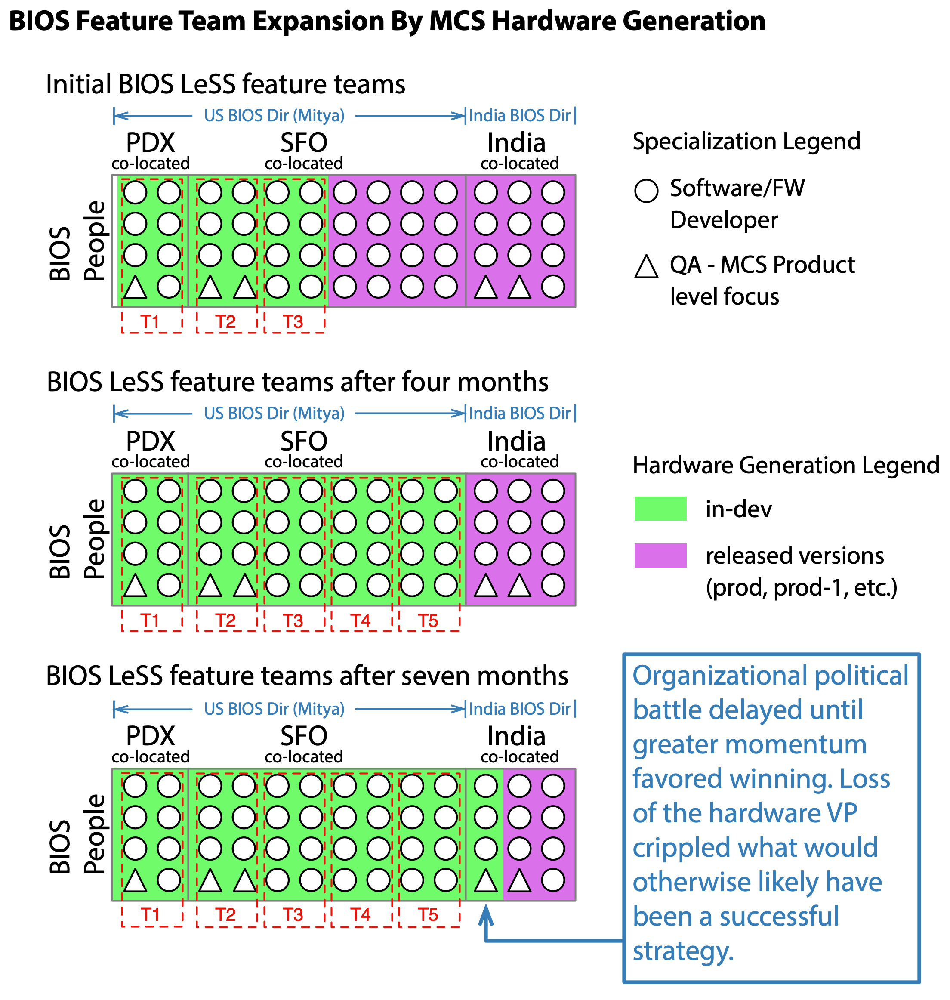
**Figure 15:** *MCS hardware generation was used as one of the component dimensions in defining the boundaries of the LeSS-like adoption within the BIOS component. With the supportive hardware VP and a few trips to India it is likely Mitya and I would have been able to successfully work out the politics. Unfortunately, the change in the VP layer coupled with the layoffs precluded this strategy. The information in the timeline and organizational structure diagrams is relevant to what you see in this diagram.*

*MCS hardware generation was used as one of the component dimensions in defining the boundaries of the LeSS-like adoption within the BIOS component. Due to historical reasons the reality was each new generation of hardware had an entirely separate BIOS code base with very little factoring of common functionality into reusable sub-components. Interestingly this provided an opportunity to grow BIOS feature teams at a more sustainable pace. As previously uninvolved BIOS developers would finish working on escaped defects related to earlier production hardware generations we would form additional BIOS component feature teams.*

## BIOS Launch Photos 

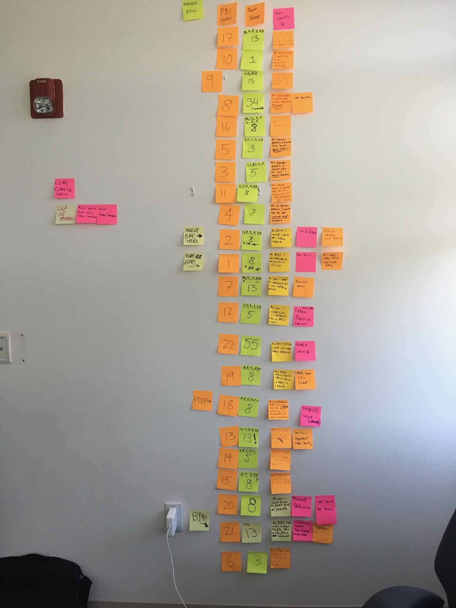
**Figure 16:** *The initial BIOS component backlog brainstorming produced a series of PBI post-its with little more than short descriptions and/or titles. Each PBI post-it was assigned an effort estimate using poker planning, and given an appropriate order in the BIOS Component Backlog. Just before leaving we captured photos of our work in preparation for transitioning the data to electronic format.*

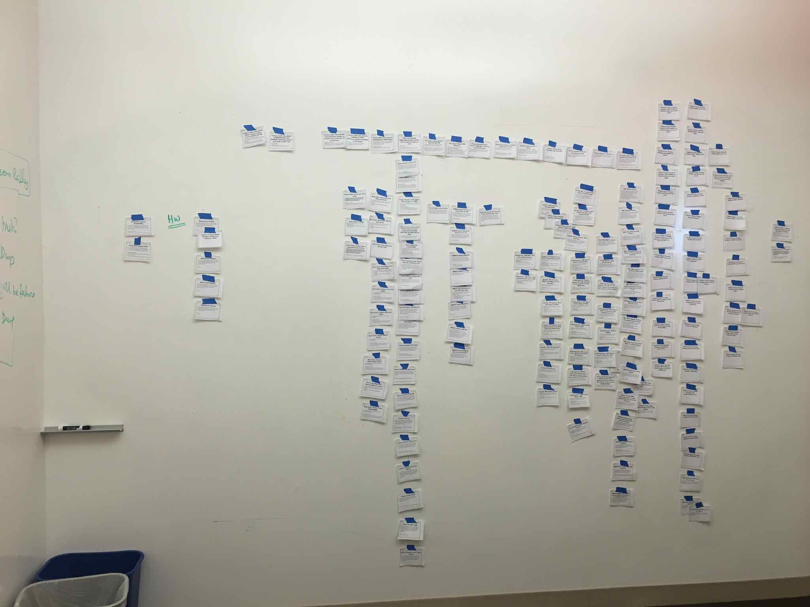
**Figure 17:** *The brief post-it note PBIs from the initial two day launch meeting were further refined and stored electronically. These refinement efforts were done by small cross-team groups focused on particular areas of the BIOS component. It took a Sprint or more before the cross-team groups reached a point of diminishing return. Now that we had enough additional insight from the cross-team refinement efforts; we returned to a physical format to help us see the bigger picture. Here you see the story cards printed out and randomly taped to the wall in preparation for more refinement activities.*

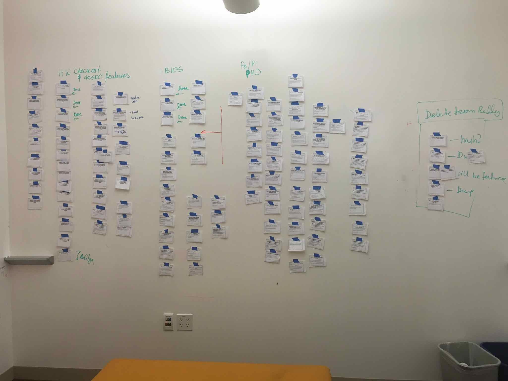
**Figure 18:** *The BIOS Fake Product Owner began to look for natural groupings and orderings. The end result was a bit of a mix between a story map and a snake-like ordered Component Backlog with epic groupings. This large map was slowly evolved over the course of several days. Various groupings of people from the BIOS feature teams would be pulled in for more insight as it made sense. As the wall settled down the Fake Product Owner made sure to call a meeting with every BIOS Scrum team member to conduct an overall sanity check. At this point the MVP had become evident as seen by the red arrow.*

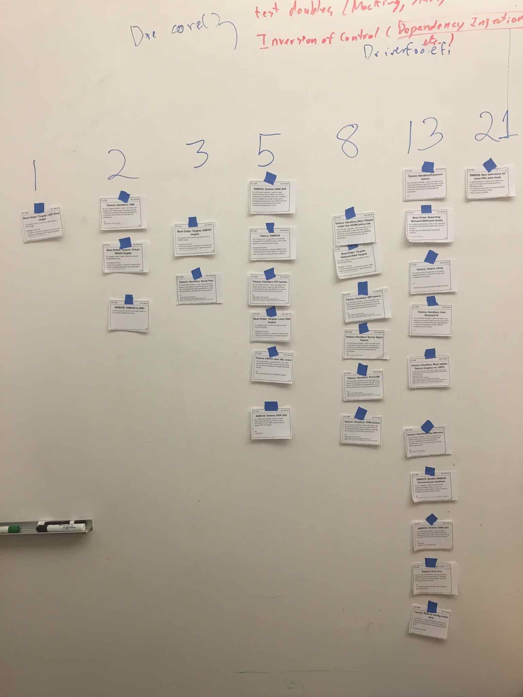
**Figure 19:** *While every BIOS Scrum team member was available during the large group multi-team sanity check, affinity estimation was used to re-estimate every remaining PBI within the MVP. Afterwards the cards were rearranged into a cleaner story map version, and Rally was updated to reflect the new information.*

## BIOS Team Helper
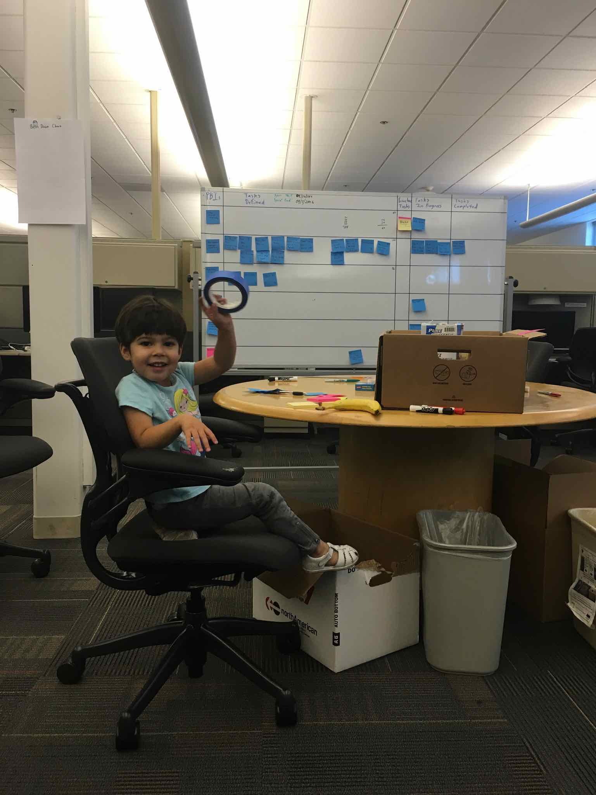
**Figure 20:** *Mitya ensured we had a helper to provide any masking tape we needed.*

## BIOS Defintion of Done Evolution

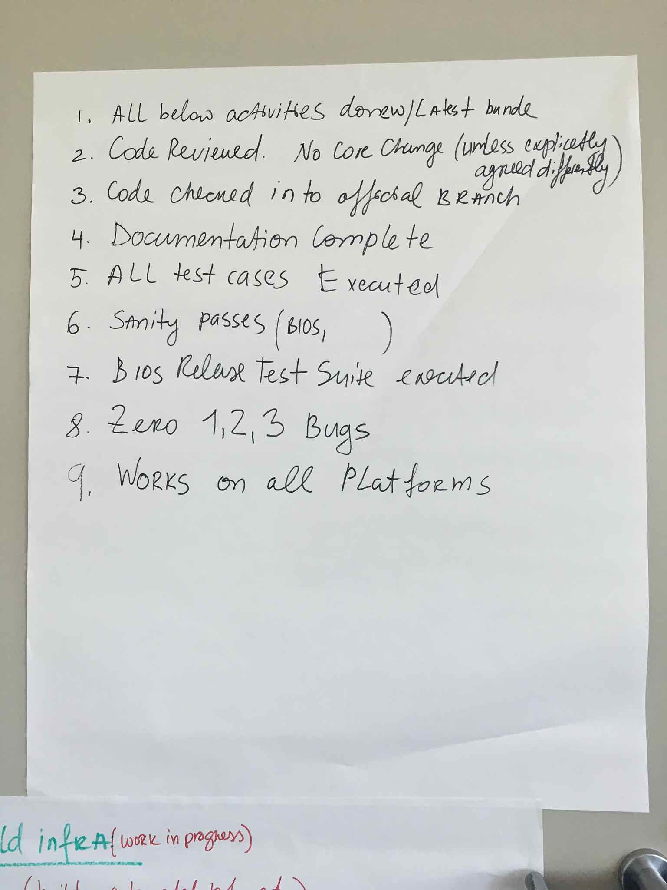
**Figure 21:** *This is the initial draft definition of Done created by the BIOS teams during their multi-day launch event.*

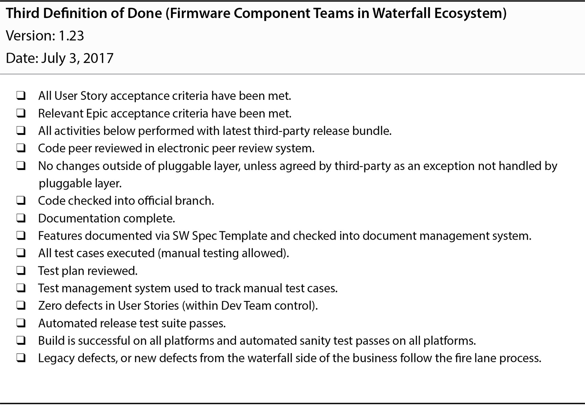
**Figure 22:** *The definition of Done used by the BIOS team evolved to what you see here after a few sprints. This example definition of Done along with additional context can be found in Table 9.3 of Forging Change.*

## BIOS Triage Guidelines
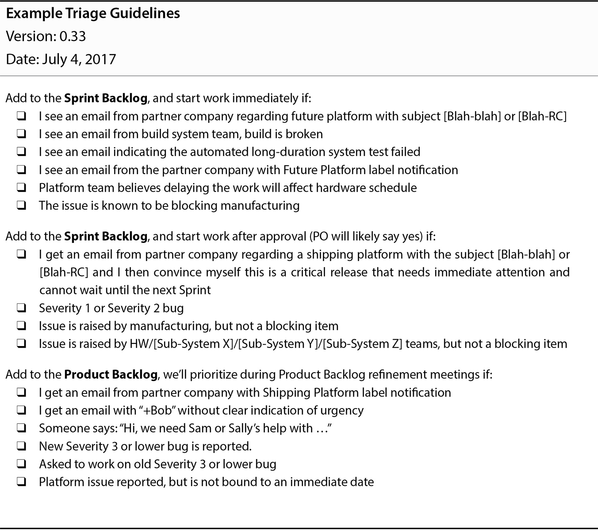
**Figure 23:** *This triage guideline used by the BIOS teams establishes three basic categories: take immediate action, ask the Product Owner, and put it on the BIOS Component Backlog. The Product Owner has clearly communicated intent while empowering the Scrum Development Teams to take immediate action when appropriate. By making the guidelines explicit, the Product Owner also improves the odds of collaboratively refining the guidelines based on the collective wisdom of the teams.*

# Reference Content

The following snippets may provide some useful jumping off points for the meetup discussion. 

## Craig Larman's Laws of Organizational Behavior

The first and fifth of Craig Larman’s Laws of Organizational Behavior: 

* Organizations are implicitly optimized to avoid changing the status quo middle- and first-level manager and “specialist” positions & power structures.
* (in large established orgs) Culture follows structure. And in tiny young orgs, structure follows culture.

All five five of Larman’s Laws of Organizational Behavior can be found on the structure page of the LeSS website at: [https://less.works/less/structure/index](https://less.works/less/structure/index)

## Parallel Organization Caveat

When describing the parallel organization strategy in _Large Scale Scrum:More With LeSS_ Larman and Vodde list a few caveats. The first caveat listed is:

>A parallel organization is not a pilot, and one consequence is that the line of organizational reporting must be separate from the traditional organization.

## LeSS Rules

The following LeSS Rule seems particularly relevant:

> LeSS Rule: For the product group, establish the complete LeSS structure “at the start”; this is vital for a LeSS adoption.

The most up to date version of the LeSS rules can be found on the LeSS website at: [https://less.works/less/rules/index](https://less.works/less/rules/index)

## LeSS Guides

Large Scale Scrum: More with Less provides the following relevant guides:

* **Guide: Build Team-Based Organizations:** Pay particular focus to the parts of this guide dealing with having stable organizations over dynamic matrixed structures.

* **Guide: LeSS Organizational Structure:** Includes the following quote: “LeSS organizations don’t have matrix structures and there are no dotted-line managers.”

* **Guide: Transitioning to Feature Teams:** Provides a high-level overview of various transition strategies.

* **Guide: One Requirement Area at a Time:** Details an incremental approach to LeSS Huge adoptions.

* **Guide: Parallel Organizations:** Details the creation of a separate organization as an adoption strategy. The caveats listed are particularly insightful.

## Additional Thoughts

* Any parallel organization should report above the level of any contract game being played.

* Senior management which is not truly bought-in is poisonous to leave within the parallel organization.

* Executive leadership is critical. An adoption effort is often one executive leadership change away from success or failure.

